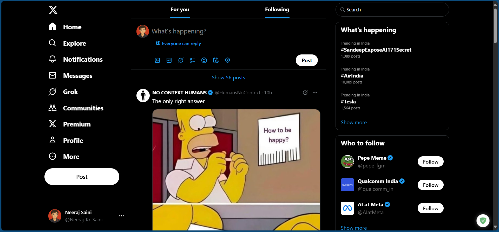

# X-Clone (HTML + Tailwind CSS)
X (Twitter) UI built with HTML + Tailwind CSS

**Live demo:** https://x-clone-bm.netlify.app/

## Summary
A responsive front-end replica of the X (Twitter) homepage built with HTML and Tailwind CSS (Play CDN). This project demonstrates layout using Tailwind utility classes and responsive design using Tailwind breakpoints.

## Features
- Header, tweet composer, timeline, and sidebar
- Responsive layout using Tailwind utility classes
- Uses Tailwind Play CDN — no local build required

## Tech stack
- HTML5
- Tailwind CSS (Play CDN)

## Getting started
1. Clone or download the repo.
2. Open `index.html` in your browser.

> **Using the Tailwind Play CDN**  
> This repo uses the Play CDN (``), which is excellent for quick prototypes. For production, build Tailwind to remove unused CSS (see below).

## Production (optional) — build Tailwind locally
If you want to convert this to a production build and remove unused CSS:
1. `npm init -y`
2. `npm install -D tailwindcss postcss autoprefixer`
3. `npx tailwindcss init -p`
4. Update `tailwind.config.js` with your content paths and run `npx tailwindcss -i ./src/input.css -o ./dist/output.css --minify`
5. Replace CDN reference with compiled `dist/output.css`.

## Project structure
